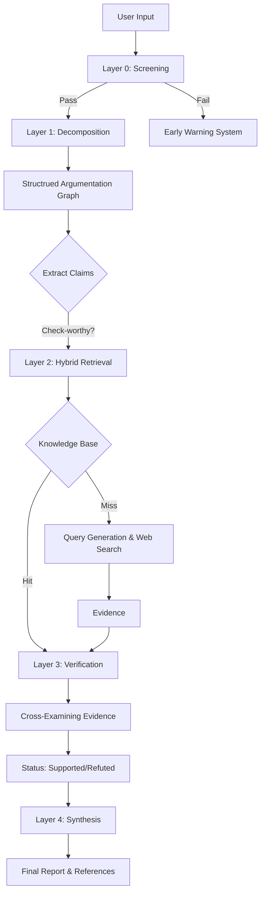

[](https://opensource.org/licenses/MIT)


# FailSafe: Automated Fact-Checking System

FailSafe is an open-source, modular framework designed to automate the verification of textual claims. It employs a multi-stage pipeline that integrates Large Language Models (LLMs) with retrieval-augmented generation (RAG) techniques to decompose complex arguments, retrieve high-quality evidence, and evaluate factuality with traceability.

##  Theoretical Foundation

FailSafe is not just a wrapper around an LLM; it is an implementation of recent research in cognitive architectures and automated reasoning. It addresses key challenges like **Sycophancy** (LLMs agreeing with users) and **Snowball Hallucinations**.

>  **Read our full [Technical Whitepaper](docs/WHITEPAPER.md)** for a deep dive into the research methodology, including Multi-Agent Debate, H-Neuron suppression, and FActScore atomic verification.

## System Architecture

The system operates on a four-stage pipeline designed to mitigate hallucinations and ensure comprehensive coverage of the input text.



## Core Modules

### 1. Pre-computation & Screening (Layer 0)
Before expensive processing, the system filters content using lightweight models:
- **Metadata Analysis**: Evaluates source credibility (if URL provided).
- **Stylometry**: Detects sensationalist patterns using NLP heuristics to flag potential misinformation early.

### 2. Decomposition (Layer 1)
Instead of treating text as a blob, FailSafe converts it into a **Structured Argumentation Graph (SAG)**.
- **Components**: `factcheck.core.Decompose`
- **Function**: Resolves coreferences and breaks complex sentences into atomic, verifiable claims, discarding subjective opinions.

### 3. Verification & Retrieval (Layer 2 & 3)
The system uses a hybrid approach to ground its verifications:
- **Vector Database (ChromaDB)**: Stores previously verified facts for low-latency retrieval (Caching).
- **Deep Search (Serper/Google)**: Fetches real-time information for novel claims.
- **Consensus Mechanism**: Multiple evidence sources are analyzed. A claim is only marked as "Supported" if a majority of high-trust sources agree.

## Technical Stack

- **Orchestration**: Python 3.10+, Celery, Redis (for asynchronous task management).
- **LLM Integration**: Abstracted layer supporting Google Gemini, OpenAI GPT-4, and Anthropic Claude.
- **Storage**: ChromaDB (Vector Store), SQLite (Metadata).
- **Frontend**: Flask-based interface for interaction and visualization.

## Installation and Setup

### Docker Deployment (Recommended)

The system is fully containerized for consistency across environments.

```bash
# 1. Clone the repository
git clone https://github.com/Amin7410/FailSafe-AI-Powered-Fact-Checking-System.git
cd FailSafe-AI-Powered-Fact-Checking-System

# 2. Configure Environment variables
cp .env.example .env
# Required: GOOGLE_API_KEY, SERPER_API_KEY

# 3. Build and Start Services
docker compose up -d --build
```

### Local Development

1.  **Dependencies**: `pip install -r requirements.txt`
2.  **Infrastructure**: Ensure a local Redis instance is running (`redis-server`).
3.  **Worker**: `celery -A tasks worker --loglevel=INFO`
4.  **Application**: `python webapp.py`

## Configuration

Configuration is managed via `config.yaml`. Key parameters include:

-   `pipeline.retriever`: Switch between `hybrid` (Search + Vector) or `serper` (Search only).
-   `llm.default_model`: Specifies the reasoning engine (e.g., `gemini-2.0-flash`).
-   `vectordb.embedding_model`: Model used for semantic search (default: `intfloat/e5-base-v2`).

###  As a Python Library

FailSafe can be easily integrated into your own Python projects:

```python
from factcheck import FactCheck

# Initialize the system with default configuration
fc = FactCheck.from_config()

# Run the pipeline
result = fc.check_text_with_progress("The Eiffel Tower is in Rome.")

print(f"Verdict: {result['verdict']}")
print(f"Summary: {result['summary']['message']}")
```

##  Live Case Studies & Demos

See FailSafe in action with these real-world examples:

-   **[ Deep Scientific Analysis (Complex)](docs/examples/DEMO1/demo_scientific_analysis.txt)**: 
        Content: A forensic scientific report analyzing a technical text about the role of Large Language Models (LLMs) in biomedicine.
        Goal: Demonstrates the system's ability to verify complex scientific claims against peer-reviewed literature.
        Result: 89% Highly Factual. It correctly validates claims about AI advancements while identifying nuances in "minimal effort" repurposing.
-   **[ Visual Fact-Check Report (General)](docs/examples/DEMO2)**: 
        Content: A visual fact-check report for the claim: "Drinking lemon can cure all kinds of cancers."
        Goal: Demonstrates the system's ability to debunk dangerous health misinformation using authoritative medical sources (e.g., National Academies, Cancer Research UK).
        Result: 0% Mostly False. It unequivocally refutes the existence of a "universal cure" and identifies logical fallacies.
-   **[ Visual Fact-Check Report (General)](docs/examples/DEMO3)**: 
        Content: A multi-claim "fake news" scenario featuring:
        Future events (e.g., "OpenAI has officially released GPT-6", "AI granted human rights").
        Pseudoscience ("Alkaline Diet cures cancer").
        Misattributed quotes (Albert Einstein on technology).
        Goal: Demonstrates the system's capacity to handle multiple disparate claims within a single narrative and identify logical impossibilities and anachronisms.
        Result: 0% Misinformation/Fiction. Classified as a complete fabrication.
> **Note:** These files are actual outputs generated by the FailSafe engine. Download and open the HTML files in your browser to interact with the full analytics.

##  Contributing

We welcome contributions! Please see our [CONTRIBUTING.md](CONTRIBUTING.md) for guidelines.

##  Star History

[](https://star-history.com/#Amin7410/FailSafe-AI-Powered-Fact-Checking-System&Date)

## Acknowledgements

This project was inspired by and built upon the architectural framework of [Loki](https://github.com/Libr-AI/OpenFactVerification). We acknowledge their pioneering work in automated fact-verification and their contribution to the open-source community.

## License
This project is licensed under the MIT License - see the [LICENSE](LICENSE) file for details.
