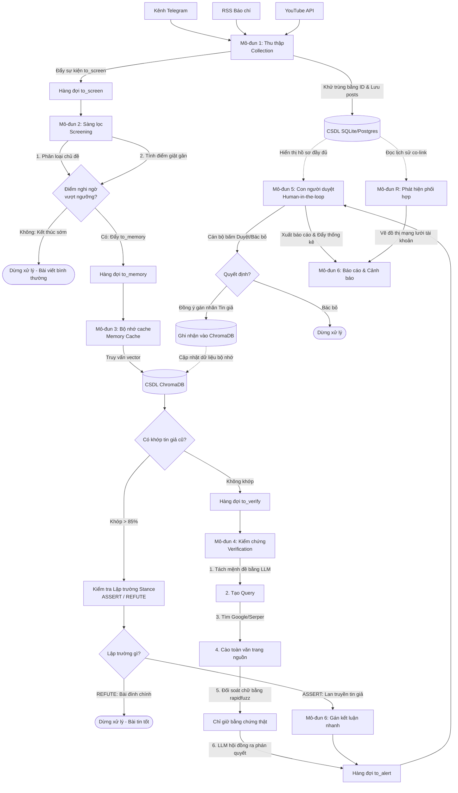

# TÀI LIỆU HƯỚNG DẪN 01: KIẾN TRÚC TỔNG QUAN HỆ THỐNG

Tài liệu này dựa trên **Tài liệu Thiết kế Kỹ thuật gốc** nhằm giúp các bạn lập trình viên Intern hình dung toàn bộ luồng đi của dữ liệu từ khi thu thập cho đến khi đưa ra màn hình duyệt và báo cáo.

---

## 1. Nguyên lý phễu lọc chi phí (Cost Funnel)

Để tránh lãng phí tiền gọi API AI (Gemini) cho tất cả bài viết quét được trên mạng xã hội, hệ thống được thiết kế theo hình một chiếc **phễu lọc chi phí**:

1.  **Tầng Sàng lọc (M2):** Chạy trên **100%** dữ liệu thô. Sử dụng các quy tắc văn phong (Regular Expression) và mô hình AI nhỏ tiếng Việt chạy cục bộ (PhoBERT/ViSoBERT) để lọc rác và chấm điểm nghi ngờ. **Tuyệt đối không gọi Gemini ở bước này**.
2.  **Tầng Bộ nhớ đệm (M3):** Chỉ chạy trên các bài viết đáng nghi (1 - 2%). Hệ thống so sánh vector ngữ nghĩa bài viết mới với kho tin giả đã biết (lưu trong ChromaDB). Nếu trùng, trả kết quả kiểm chứng ngay lập tức.
3.  **Tầng Kiểm chứng sâu (M4):** Chỉ chạy khi **bị trượt bộ nhớ đệm** (Cache Miss). Lúc này hệ thống mới dùng Gemini để bóc tách mệnh đề, cào tìm bằng chứng trực tiếp trên Internet và ra phán quyết.

---

## 2. Sơ đồ luồng dữ liệu 7 Mô-đun (Architecture Flowchart)

Dưới đây là sơ đồ Mermaid trực quan hóa đường đi của một bài đăng (`post`) qua các mô-đun:

---

## 3. Bản đồ vai trò của 7 Mô-đun (Dành cho Intern)

*   **M1 (Thu thập):** Đóng vai trò làm "người đi chợ", lấy dữ liệu từ các kênh mạng xã hội, làm sạch định dạng thô và lưu vào bảng `posts`.
*   **M2 (Sàng lọc):** Làm "người phân loại sơ bộ", dùng các bộ lọc Regex và model PhoBERT chạy CPU cục bộ cực nhanh để vứt bỏ các bài viết rác (quảng cáo, chào hỏi, tin thường).
*   **M3 (Bộ nhớ cache):** Làm "người ghi nhớ", xem câu này ai nói chưa. Nếu là tin giả cũ được copy-paste lại thì dùng luôn kết luận cũ, tránh tốn tiền gọi Gemini.
*   **M4 (Kiểm chứng):** Làm "thám tử điều tra", khi gặp tin hoàn toàn mới thì bóc tách từng ý, lên Google tìm thông tin từ cổng chính phủ, tải trang báo về đối chiếu từ chữ một để đưa ra phán quyết chuẩn xác.
*   **M5 (Cán bộ duyệt):** Làm "quan tòa", máy chỉ dọn sẵn hồ sơ bằng chứng, cán bộ đọc và bấm nút kết án. Quyết định của cán bộ sẽ được nạp ngược lại kho M3 để cỗ máy thông minh hơn.
*   **M6 (Báo cáo):** Trực quan hóa số liệu lên Dashboard.
*   **MR (Phát hiện phối hợp):** Chạy ngầm gom các bài viết đăng cùng link trong thời gian ngắn để chỉ điểm mạng lưới botnet.
