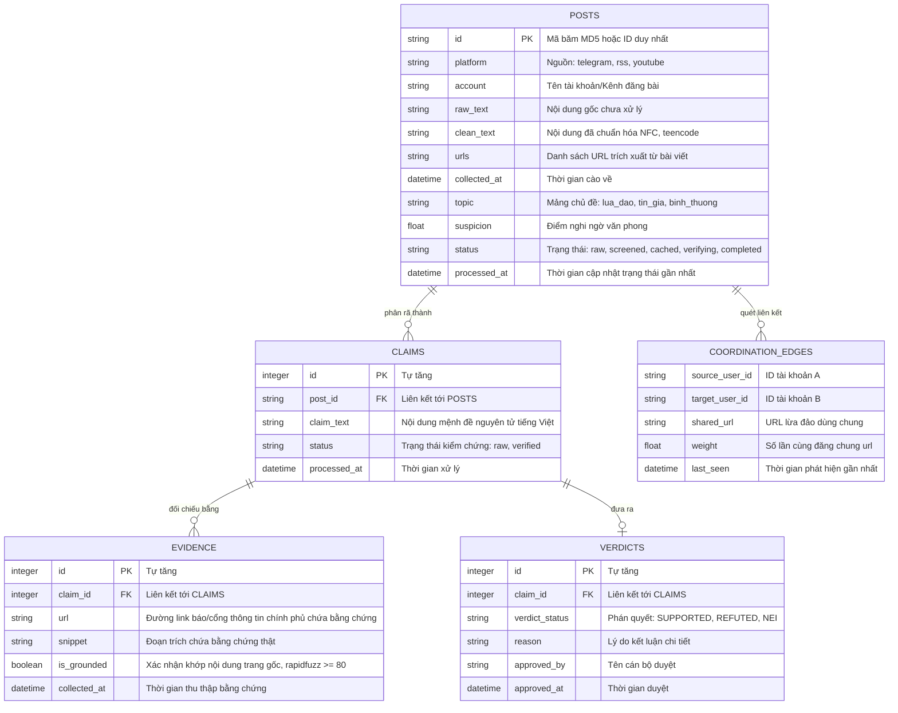

# TÀI LIỆU HƯỚNG DẪN 02: SƠ ĐỒ CƠ SỞ DỮ LIỆU & HÀNG ĐỢI

Tài liệu này chi tiết hóa cấu trúc dữ liệu lưu trữ (CSDL Quan hệ) và cấu trúc truyền tải sự kiện (Redis Queue) của hệ thống MVP dựa theo đúng **Tài liệu Thiết kế Kỹ thuật gốc**.

---

## 1. Sơ đồ Quan hệ Thực thể (ERD Diagram)

Dưới đây là thiết kế CSDL rút gọn dạng lược đồ quan hệ thực thể, biểu diễn mối quan hệ cha - con giữa bài viết thu thập được (`posts`), các mệnh đề được phân tách (`claims`), bằng chứng cào từ web (`evidence`) và phán quyết cuối cùng của cán bộ (`verdicts`).



---

## 2. Thiết kế Hợp đồng sự kiện hàng đợi (Redis Queue Message Schema)

Hệ thống MVP sử dụng **Redis List** để làm hàng đợi truyền dữ liệu bất đồng bộ giữa các module thông qua cơ chế đẩy (`LPUSH`) và đọc (`RBRPOP`). Dưới đây là định dạng dữ liệu JSON bắt buộc (Hợp đồng dữ liệu) của mỗi hàng đợi:

### A. Hàng đợi `to_screen` (Từ M1 -> M2)
*Mục đích:* Đẩy bài đăng thô vừa cào về sang cho bộ lọc văn phong sàng lọc.
```json
{
  "post_id": "md5_hash_of_post_content",
  "platform": "telegram",
  "collected_at": "2026-07-09T22:00:00Z",
  "blocklist_hit": false
}
```

### B. Hàng đợi `to_memory` (Từ M2 -> M3)
*Mục đích:* Chuyển tiếp các bài đăng đáng nghi ngờ (vượt ngưỡng điểm giật gân) sang tra cứu bộ nhớ đệm tin giả.
```json
{
  "post_id": "md5_hash_of_post_content",
  "topic": "tin_gia",
  "suspicion": 0.88,
  "blocklist_hit": false
}
```

### C. Hàng đợi `to_verify` (Từ M3 -> M4)
*Mục đích:* Chuyển các bài đăng đáng nghi bị trượt bộ nhớ đệm (Cache Miss) sang cho LLM kiểm chứng sâu.
```json
{
  "post_id": "md5_hash_of_post_content",
  "topic": "tin_gia",
  "suspicion": 0.88,
  "blocklist_hit": false
}
```

### D. Hàng đợi `to_alert` (Từ M4/M3 -> M5)
*Mục đích:* Đẩy hồ sơ đã dựng xong bằng chứng sang hàng đợi duyệt của Cán bộ.
```json
{
  "post_id": "md5_hash_of_post_content",
  "verdict_id": 1245,
  "priority": "high"
}
```
 Ghi chú cho Intern: Cần đảm bảo các mô-đun xử lý (Consumer) luôn có tính **idempotent (thao tác trùng lặp không gây lỗi dữ liệu)** bằng cách kiểm tra sự tồn tại của `post_id` trong database trước khi chèn mới dữ liệu.
