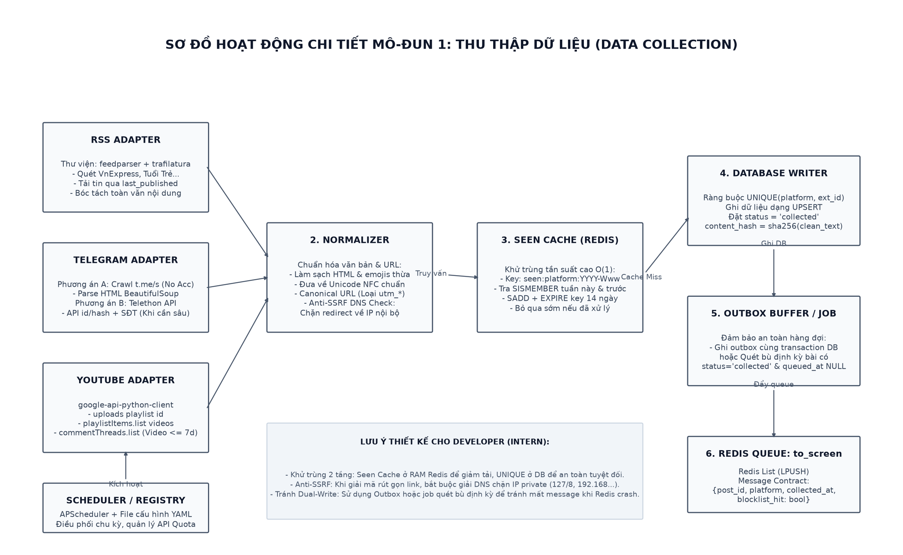
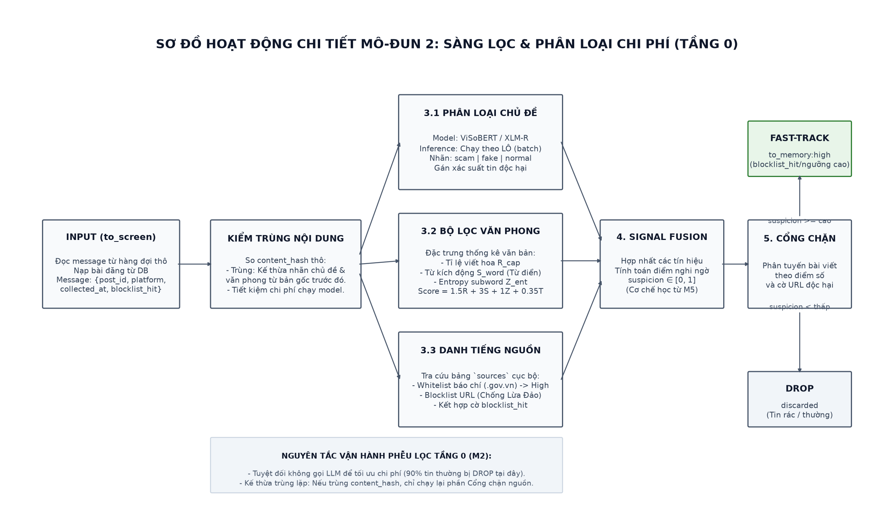
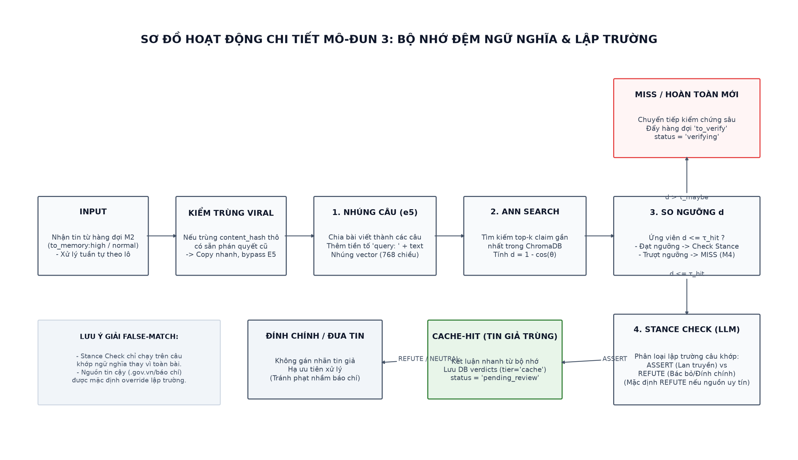
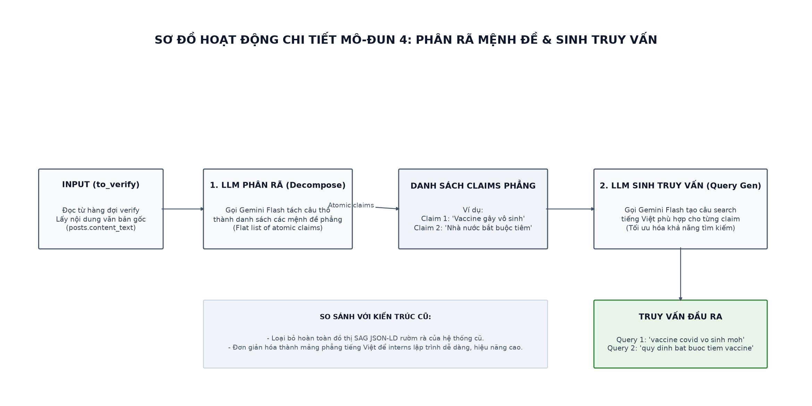
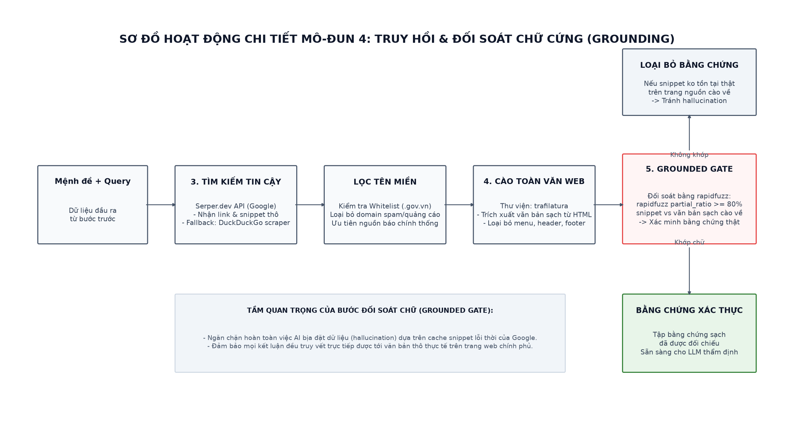
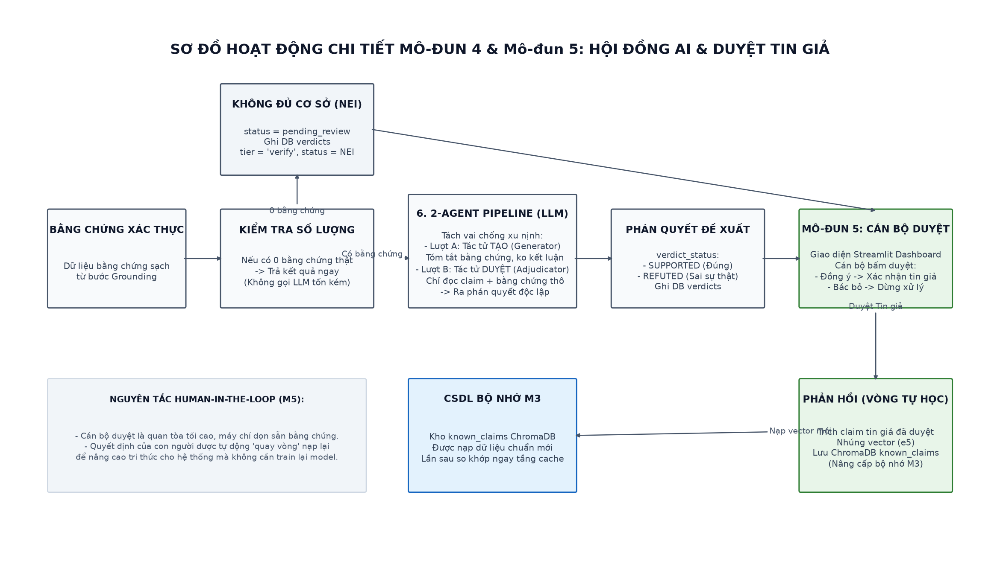
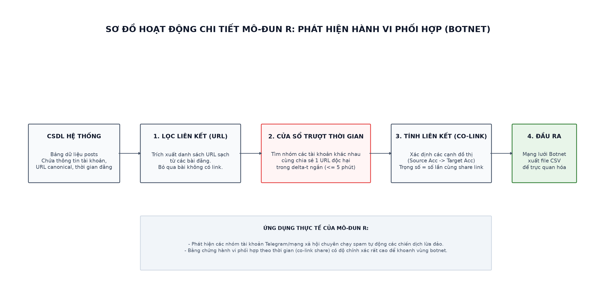

# TÀI LIỆU HƯỚNG DẪN 03: HƯỚNG DẪN ÁNH XẠ CODE THEO MÔ-ĐUN (MIGRATE GUIDE)

Tài liệu này là **bản đồ chỉ đường** dành riêng cho đội Dev (Intern). Tài liệu lấy **Tài liệu Thiết kế Kỹ thuật mới (gốc)** làm kim chỉ nam yêu cầu, đồng thời chỉ ra các file code tương ứng trong **repo FailSafe cũ** để các bạn tham khảo cách tổ chức thư mục.

---

> [!IMPORTANT]
> **Quy tắc tối thượng cho Intern:**
> 1. Chỉ dùng code cũ của FailSafe làm **tài liệu tham khảo để hình dung cách chia file/giao diện**.
> 2. **Tuyệt đối không sao chép nguyên si (copy-paste)** tư duy thiết kế cũ (tiếng Anh, Celery, đồ thị lập luận SAG phức tạp).
> 3. Luôn lấy code kiểm thử trong thư mục [spike/](../../A/spike/) làm mẫu chuẩn đã chạy thành công thực tế cho tiếng Việt.

---

## Mô-đun 1 — Thu thập (Collection)

### 1. Yêu cầu của Thiết kế mới (Gốc)
*   Thu thập dữ liệu tăng dần (incremental) từ 3 nguồn: Telegram (kênh công khai), RSS các báo chí chính thống, và YouTube API.
*   Bóc tách nội dung chính sạch, danh sách link liên kết và lưu vào bảng `posts` của SQLite/Postgres.
*   Đẩy thông điệp vào hàng đợi `to_screen` của Redis.

### 2. Vị trí file tham khảo trong FailSafe cũ
*   Tham khảo thư mục `scripts/` hoặc [demo_library_usage.py](../demo_library_usage.py) để xem cách gọi thư viện đọc tin.
*   *Lưu ý:* Bản cũ chỉ cào RSS cơ bản, **không có bộ cào Telegram và YouTube**. Dev cần tự viết mới module này sử dụng thư viện Telethon/Pyrogram (cho Telegram) và Google API Client (cho YouTube).
*   **Sơ đồ hoạt động chi tiết Mô-đun 1 (Thu thập):**

---

## Mô-đun 2 — Sàng lọc (Screening)

### 1. Yêu cầu của Thiết kế mới (Gốc)
*   Đọc sự kiện từ hàng đợi `to_screen`.
*   Chạy bộ lọc văn phong tiếng Việt (Regex tính mật độ viết hoa, mật độ từ kích động như "sốc", "khẩn cấp", nhồi từ khóa) kết hợp model ngôn ngữ nhỏ cục bộ (**PhoBERT/ViSoBERT**) để chấm điểm giật gân/nghi ngờ và gán chủ đề.
*   Chỉ bài viết đáng nghi (vượt ngưỡng điểm) mới được đẩy vào hàng đợi `to_memory`. **Không gọi Gemini ở bước này**.

### 2. Vị trí file tham khảo trong FailSafe cũ
*   Tham khảo file [Screening.py](../factcheck/core/Screening.py).
*   *Cảnh báo cho Intern:* File cũ dùng thư viện `nltk` và từ điển tiếng Anh. Bạn **phải viết lại hoàn toàn bộ từ điển và quy tắc regex** cho tiếng Việt (dựa theo các từ khóa lừa đảo/tin giả tiếng Việt).
*   **Sơ đồ hoạt động chi tiết Mô-đun 2 (Sàng lọc):**

---

## Mô-đun 3 — Bộ nhớ (Memory Cache)

### 1. Yêu cầu của Thiết kế mới (Gốc)
*   Đọc bài viết nghi vấn từ hàng đợi `to_memory`. Chuyển văn bản thành vector nhúng bằng model **multilingual-e5-base** và truy vấn độ tương đồng cosine trong **ChromaDB**.
*   **Nếu trùng khớp (> 85%):** Chạy tiếp bước **Lập trường (Stance Check)** gọi Gemini hỏi xem bài viết này đang lan truyền tin giả (`ASSERT`) hay đính chính/bác bỏ (`REFUTE`).
*   Nếu là lan truyền (`ASSERT`), lấy kết quả phán quyết cũ gắn thẳng cho bài đăng mới và chuyển tiếp sang hàng đợi `to_alert`.

### 2. Vị trí file tham khảo trong FailSafe cũ
*   Tham khảo [KnowledgeBase.py](../factcheck/core/KnowledgeBase.py) để xem cách khởi tạo và kết nối database ChromaDB.
*   *Cảnh báo quan trọng:* Bản FailSafe cũ **hoàn toàn không có bộ Stance Check**. Dev bắt buộc phải xem file kiểm thử [embed_demo.py](../../A/spike/embed_demo.py) để biết cách cài đặt prompt Stance Check chống nhận nhầm bài đính chính.
*   **Sơ đồ hoạt động chi tiết Mô-đun 3 (Bộ nhớ cache & Lập trường):**

---

## Mô-đun 4 — Kiểm chứng (Verification)

### 1. Yêu cầu của Thiết kế mới (Gốc)
*   Đọc tin từ hàng đợi `to_verify`.
*   Bước 1: LLM phân tách bài viết thành các mệnh đề độc lập.
*   Bước 2: LLM tạo câu truy vấn tìm kiếm tiếng Việt cho mỗi mệnh đề.
*   Bước 3: Gọi Google/Serper API (fallback cào DuckDuckGo bằng BeautifulSoup) lấy link và snippet.
*   Bước 4: Tải toàn văn trang web bằng `trafilatura`.
*   Bước 5: **Đối soát chữ cứng** (`rapidfuzz` partial ratio >= 80) để xác nhận đoạn trích snippet thực sự tồn tại trên trang báo gốc. Loại bỏ bằng chứng giả.
*   Bước 6: Gửi các bằng chứng sạch cho 2-Agent Pipeline (Tác tử Tạo & Tác tử Duyệt) để phán quyết (`SUPPORTED` / `REFUTED` / `NEI`).

### 2. Vị trí file tham khảo trong FailSafe cũ
*   Tham khảo file [Decompose.py](../factcheck/core/Decompose.py) (Tách câu) và [ClaimVerify.py](../factcheck/core/ClaimVerify.py) (Kiểm chứng).
*   *Cảnh báo quan trọng:* File `Decompose.py` cũ viết rất phức tạp nhằm vẽ đồ thị lập luận SAG dạng JSON-LD. Bạn **phải vứt bỏ phần đồ thị rườm rà này** và đổi sang trả về danh sách mệnh đề phẳng (JSON list of strings) theo mẫu chuẩn trong file kiểm thử [verify.py](../../A/spike/verify.py). File cũ cũng thiếu bộ lọc `rapidfuzz` tiếng Việt.
*   **Sơ đồ hoạt động chi tiết Mô-đun 4 (Phần 1 - Phân rã mệnh đề):**

*   **Sơ đồ hoạt động chi tiết Mô-đun 4 (Phần 2 - Truy hồi & Grounding):**

*   **Sơ đồ hoạt động chi tiết Mô-đun 4 & M5 (Phần 3 - Tác tử Tạo/Duyệt & Cán bộ duyệt):**

---

## Mô-đun 5 — Con người duyệt (Human Verification)

### 1. Yêu cầu của Thiết kế mới (Gốc)
*   Đọc hồ sơ kiểm chứng từ hàng đợi `to_alert`. Hiển thị lên màn hình duyệt của Cán bộ (gồm bài viết, các mệnh đề con, các bằng chứng trích dẫn và verdict đề xuất).
*   Khi cán bộ bấm nút "Xác nhận tin giả", hệ thống phải tự động lưu mệnh đề này vào ChromaDB (M3) để phục vụ việc so khớp nhanh cho các tin trùng lần sau.

### 2. Vị trí file tham khảo trong FailSafe cũ
*   Giao diện web cũ được viết bằng Flask tại file [webapp.py](../webapp.py) và các template HTML trong `templates/`.
*   *Khuyên dùng cho Intern:* Để tiết kiệm thời gian và code sạch hơn, các bạn **nhất định nên dựng giao diện bằng Streamlit** thay vì viết Flask kết hợp HTML/CSS thuần (rất dễ bị chậm tiến độ 15 ngày).

---

## Mô-đun 6 — Báo cáo (Reporting)

### 1. Yêu cầu của Thiết kế mới (Gốc)
*   Hiển thị thống kê tổng quan: lượng bài quét được, số bài tin giả đã xác nhận, thống kê các chủ đề.
*   Xuất báo cáo dưới dạng hồ sơ bằng chứng (.pdf hoặc .docx).

### 2. Vị trí file tham khảo trong FailSafe cũ
*   Xem cách vẽ biểu đồ thống kê trong file [webapp.py](../webapp.py).

---

## Mô-đun R — Phát hiện phối hợp (Coordination detection)

### 1. Yêu cầu của Thiết kế mới (Gốc)
*   Chạy song song, phân tích lịch sử thời gian đăng bài và các link lừa đảo trích từ bài viết.
*   Phát hiện các nhóm tài khoản Telegram cùng chia sẻ một link lừa đảo trong một khung thời gian rất ngắn (ví dụ < 5 phút) để chỉ điểm mạng lưới botnet.
*   Xuất mạng lưới này dưới dạng tệp CSV cạnh (source_user, target_user, url) để trực quan hóa đồ thị.

### 2. Vị trí file tham khảo trong FailSafe cũ
*   Tham khảo file [tasks.py](../tasks.py) để xem cách gom nhóm và xuất dữ liệu.
*   **Sơ đồ hoạt động chi tiết Mô-đun R (Phát hiện phối hợp):**

